Bota - over The Air (Not cloud though :) )

# 📸 Screenshots
| Bota                                |
|-------------------------------------|
|  |

## Features
- Connect to any platform iOS, android, windows, macOS, ubuntu
- You can transfer and receive files to and from multiple users simultaneously
- Does not use any internet connection, so your data is in your hands
- Backup your data to your desktop within one click

| Architecture                                 |
|----------------------------------------------|
| 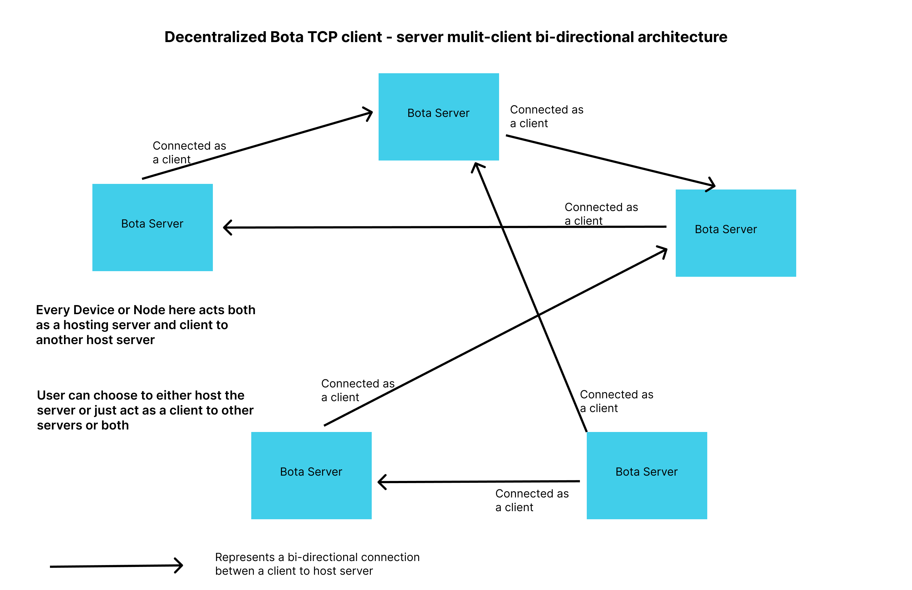 |
|                                              |

## How it works
-- Works on decentralized TCP sockets client-server architecture with devices connected over same Wifi LAN or mobile hotspot. 
-- Every device can act as a host server or client to a host server or both at the same time for connecting to 2 different clients/hosts.
-- This decentralization allows transmission and receive of files both at same time through multiple clients/hosts.
-- 2 channel socket communication to receive and transfer data simultaneously
-- It requires permission for managing external storage to perform read/write operations to the system.
-- developed with MVVM + Repository architecture

| App Screenshots                       | App screenshots                        |
|---------------------------------------|----------------------------------------|
| 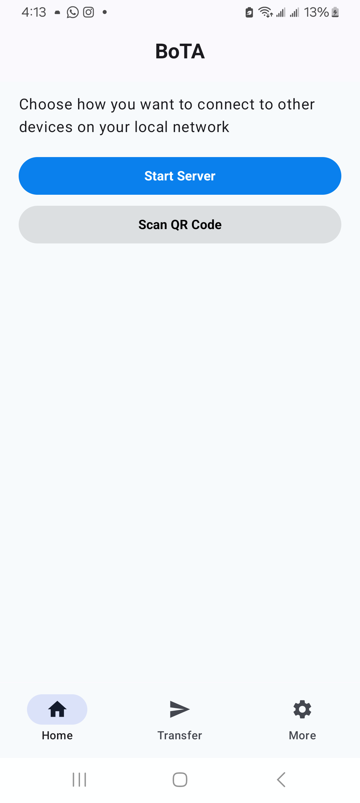 | 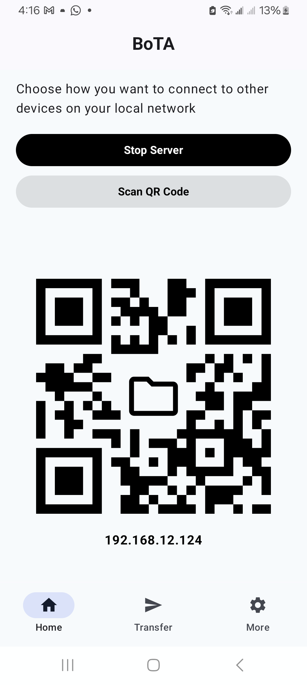     | 
| 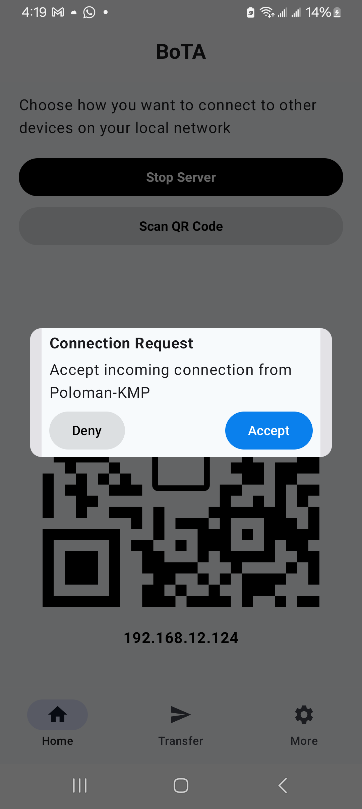 | 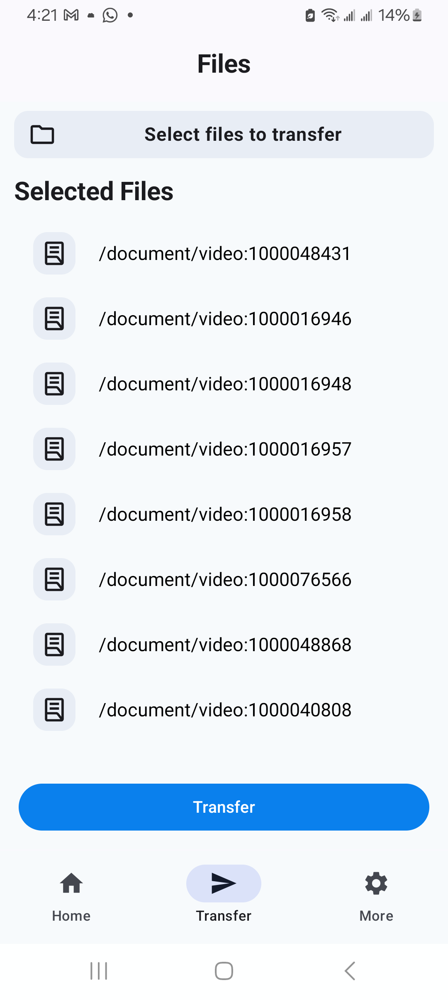  |
| 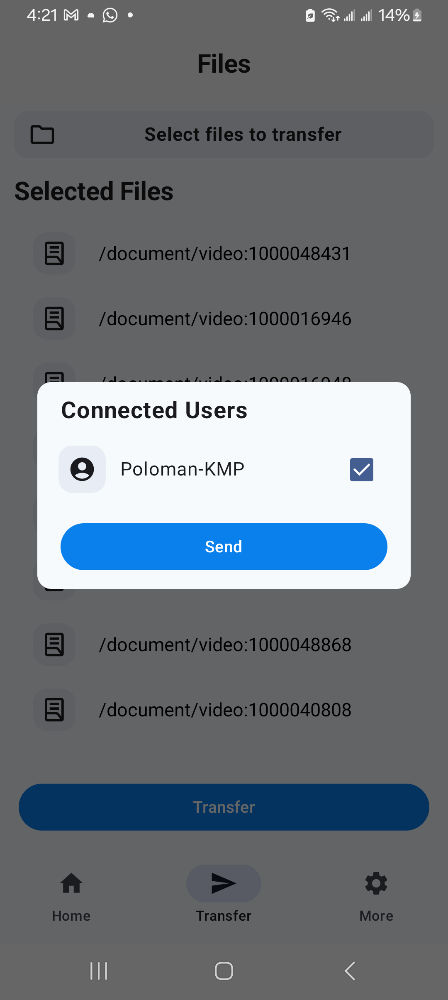 | 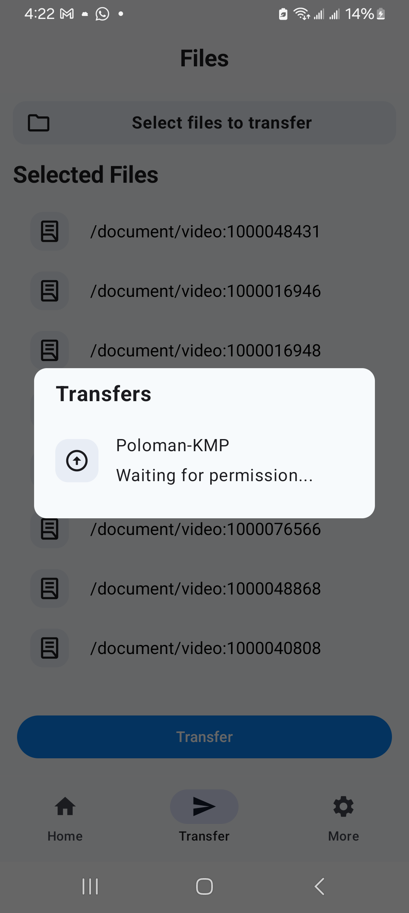  |
| 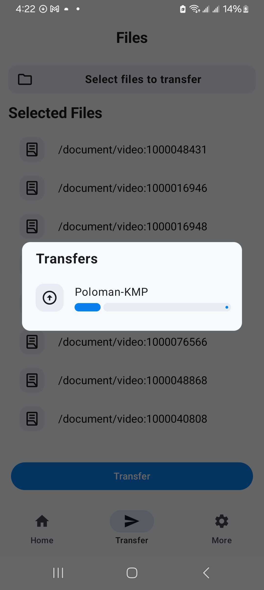 | 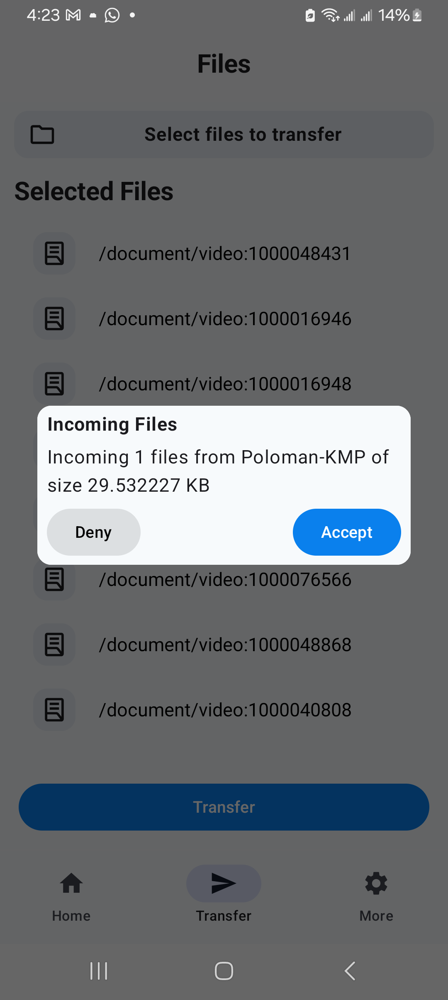  |
| 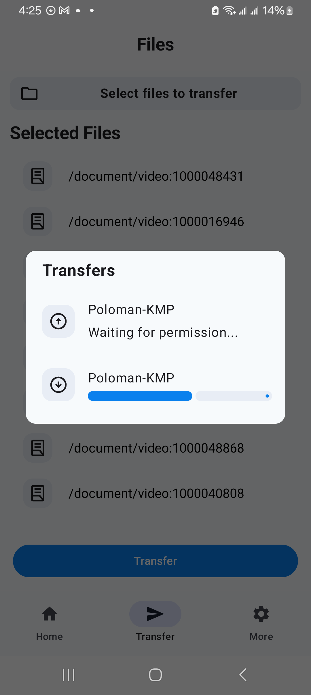 | 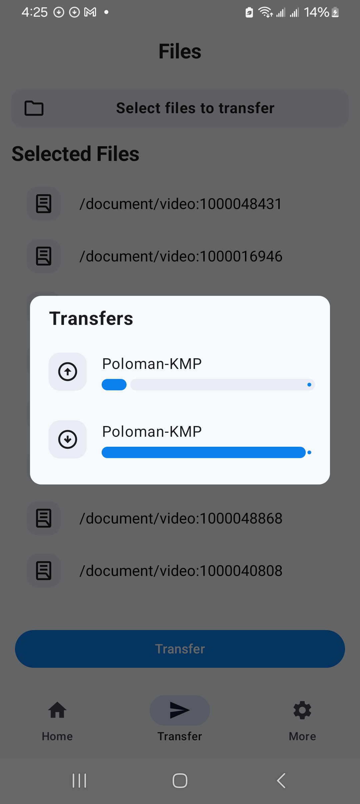 |

# Desktop app preview
| 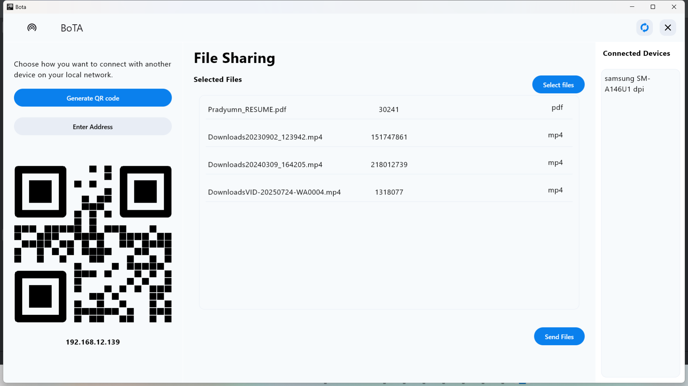 | 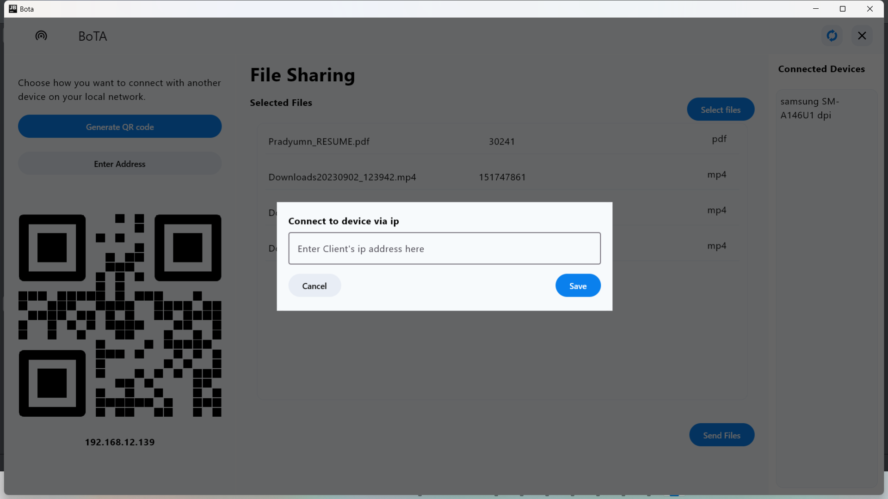 |

# Depends on 
-- Hilt for Dependency injection
-- Coil for image loading 
-- alexzhirkevich/custom-qr-generator for QR generation
-- https://github.com/G00fY2/quickie for scanning the QR code 
-- TCP sockets for client-server connection
