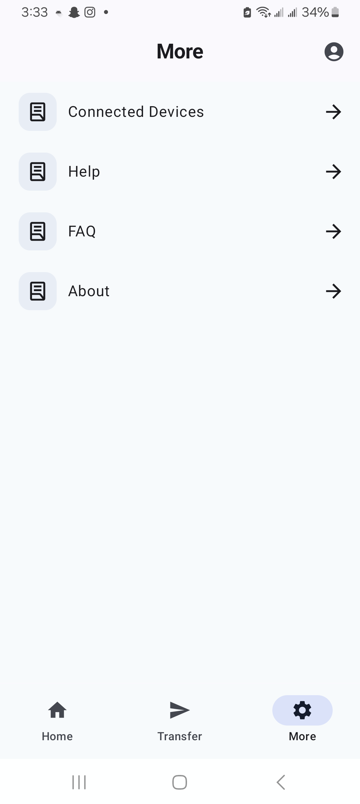

Backup over The Air (Not cloud though :) )

# 📸 Screenshots

| Home                             | Accept Connection request          | 
|    |  | 

| Select Files to Transfer                | Files Selected                       |
|-----------------------------------------|--------------------------------------|
|  |  | 
|                                         |                                      |

## Features 
- Connect to any platform iOS, android, windows, macOS, ubuntu
- You can transfer and receive files to and from multiple users simultaneously
- Does not use any internet connection, so your data is in your hands
- Backup your data to your desktop within one click

## How it works
-- Works on socket-client architecture with devices connected over same Wifi LAN or mobile hotspot
-- 2 channel socket communication to receive and transfer data simultaneously
-- developed with MVVM + Repository architecture

## Release 
-- Version1 will be released around 27th July, 2025 on playstore for android and desktop
-- iOS application will be released after mid-August
-- have any questions, reach out to me on pupadh22@asu.edu
-- want to contribute, reach out to me, would love your help !
